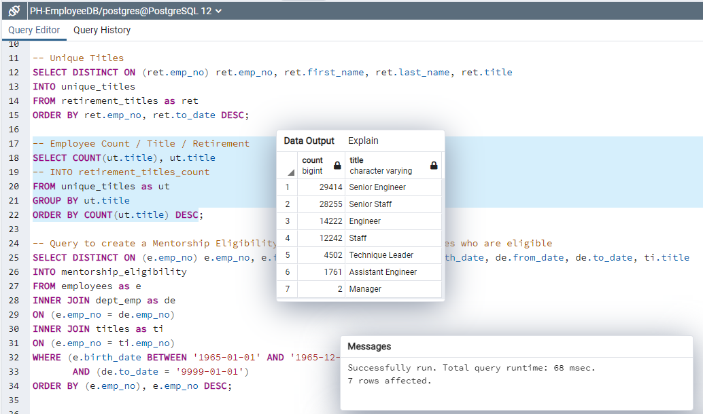
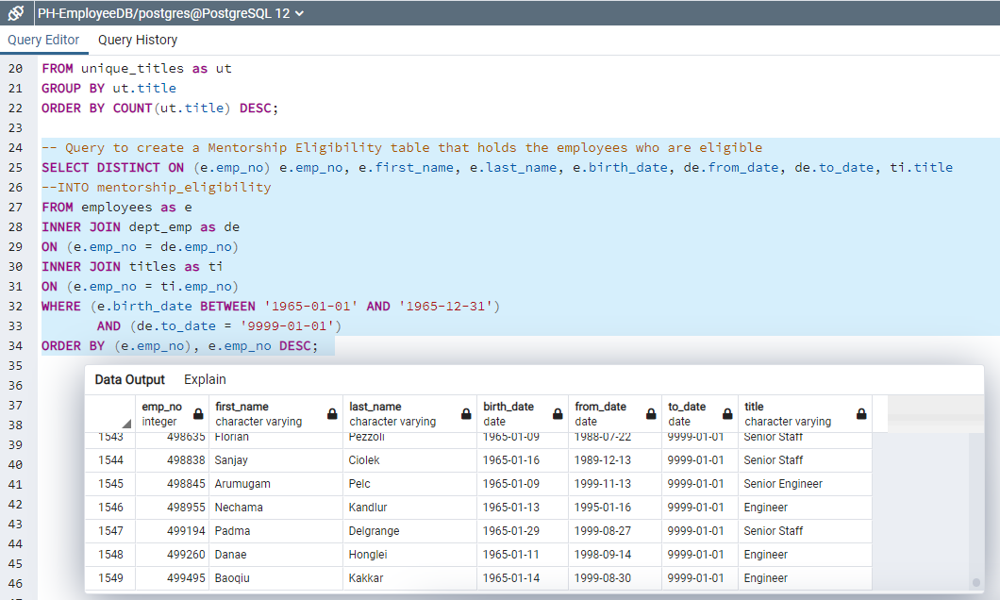
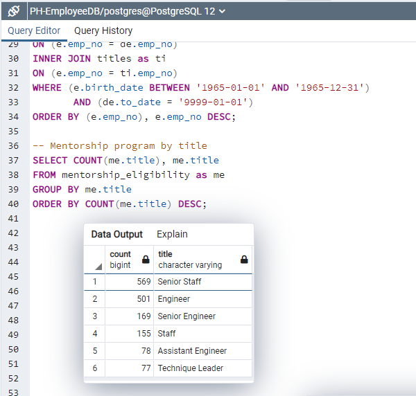

# Pewlett-Hackard-Analysis

SQL Analysis

## Objetive

The main purpose of this analysis is to help the company to face the coming turnaround as a result of the retirement of their senior team. One of the strategies is to identify the next generation of employees that can be developed and supported by mentorship to take upcoming vacancies.

## Results

The analysis shows over 90k current employees who were born between January 1, 1952, and December 31, 1955, and are soon to retire.

But the main challenge is that the company would not be able to substitute or replace internally with its own talent since there are only 1,549 employees suitable to start with the mentorship program, so the human resources department should work hard in next years to attract, develop and retain talent. 

## Summary

Is clear that Senior Management in Engineer and Staff are key roles who need the most attention since they are the most represented in the retirement schedule, and the mentor program would not be enough since there are only 569 for Senior Staff and 169 as a Senior Engineer.

So there is a major challenge to the human resources department to attract, retain and develop talent in a fast track process.

